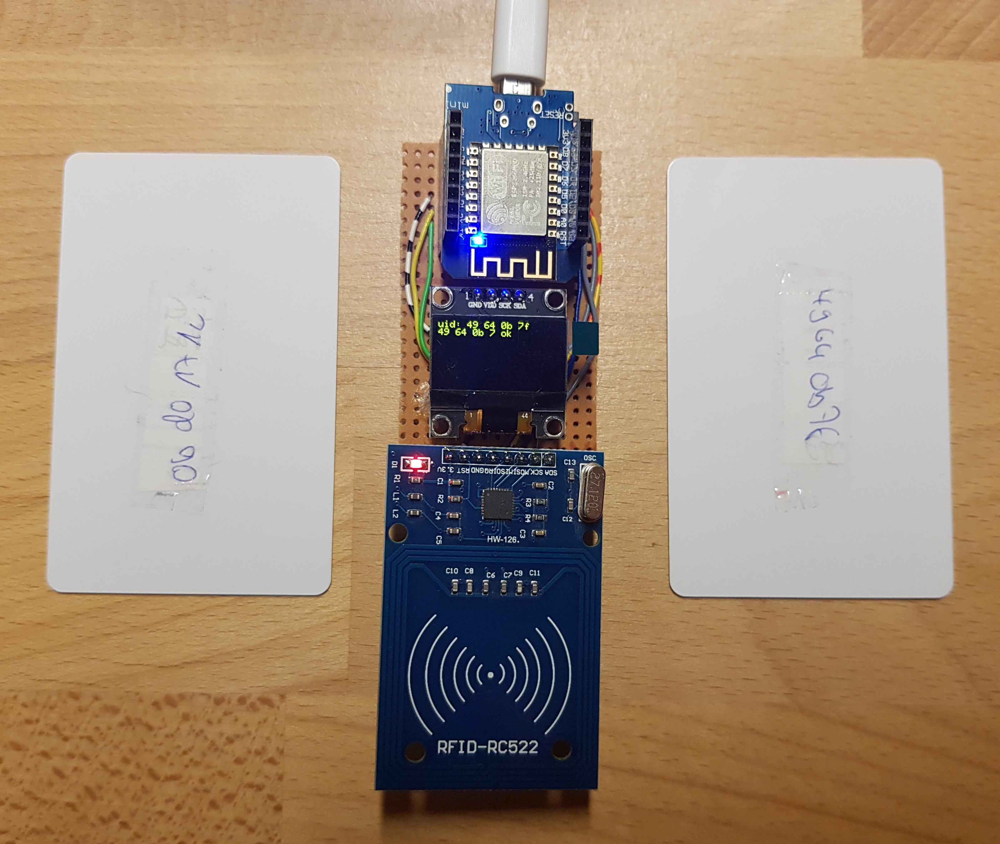
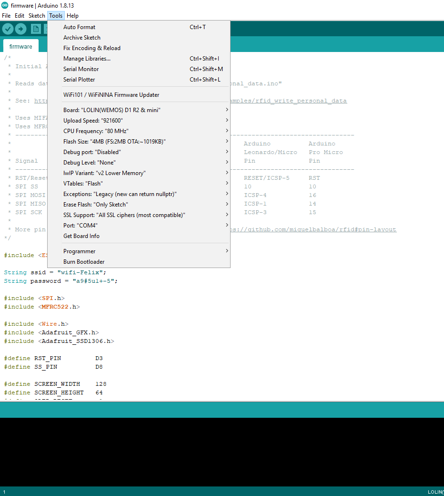

## Prototype Circuit Board

## Build

For WeMos D1 Mini

## Wiring

| WeMos D1 Mini | ESP8266 | Components     |
|---------------|---------|----------------|
| MOSI D7       | GPIO13  | MOSI (MFRC522) |
| MISO D6       | GPIO12  | MISO (MFRC522) |
| SCK D5        | GPIO14  | SCK (MFRC522)  |
| SS D8         | GPIO15  | SDA (MFRC522)  |
| 3.3V          | 3.3V    | 3.3V (all)     |
| GND           | GND     | GND (all)      |
| SDA D2        | GPIO4   | SDA (SSD1306)  |
| SCL D1        | GPIO5   | SCL (SSD1306)  |
| D4            | GPIO2   | BUILTIN_LED    |

